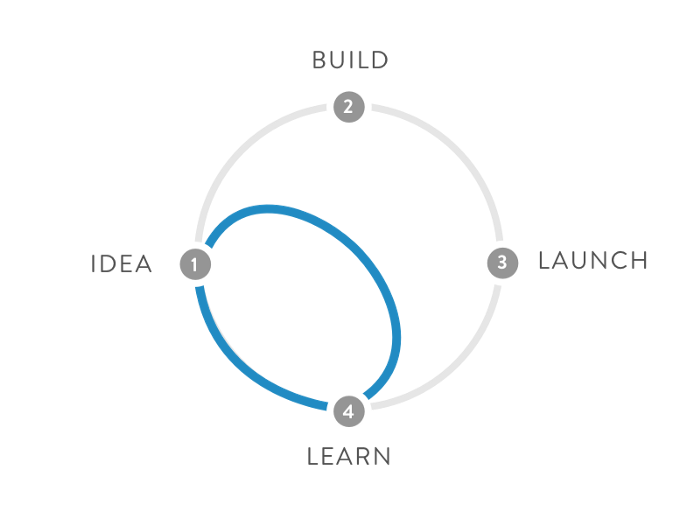
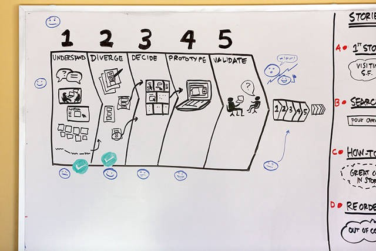
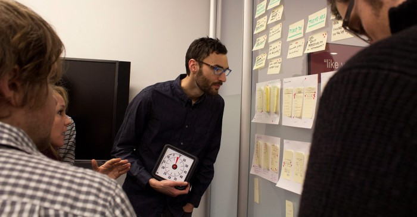
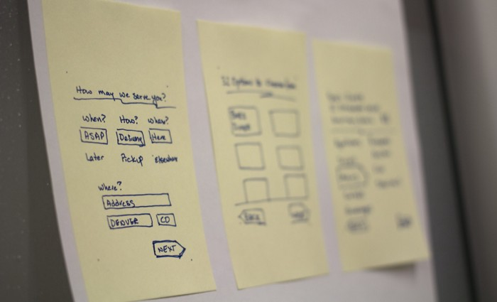
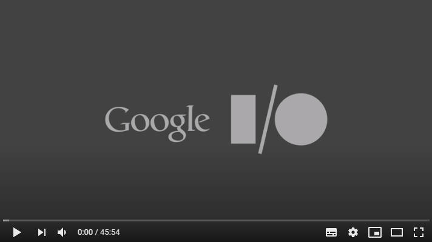

# Google Design Sprint
Google Design Sprint: an “express” design process where a group of people get together for 5 days to answer critical business questions through design, prototyping and testing of ideas with users.

 

The process was developed and announced by Google Ventures, an arm of Google focused on testing and accelerating ideas that are still in the early stages of development.
The main advantage of this 5-day process over so many other methodologies out there is that it takes a very advantageous shortcut: instead of waiting to launch an MVP (Minimum Viable Product) to find out if the idea is a good one or not, a process that can take several months, Design Sprint focuses specifically on validating the idea with users and shortens the process to 40 hours of work.

 

Much better to know if the idea will work or not BEFORE having to go through all the work of developing it completely, right?
## Summary:
 - *What is it? * 5 days to create, design, prototype and test an idea.
 - *Who is it recommended for? * Startups at an early stage; ideas that have yet to be matured; internal projects.
 - *When to use? * Before investing time and money in a startup or idea; before a newly formed agile team starts working on a project; before you start to draw a complex feature in depth.
 - *Who is involved in the sprint? * At least one Designer, a Stakeholder (CEO of the startup, owner of the money, owner of the idea, owner of the ball), a Product Manager, a person who knows the users of the product well, and someone with a more technical background (Developer). Oh, and of course, a facilitator to lead the group sessions.
 
## How does Design Sprint work?
Before you start Design Sprint, you need to choose the problem to be solved. When they are all lined up, gather the team in a room, block everyone's calendar and secure some basic materials to use that week (post-its, pen, paper, etc.).

 

## Monday: UNPACK
On the first day of Sprint, your team will externalize everything they know about the idea. The expertise is usually spread across several different heads, and making sure that everyone is starting out aligned is critical to the success of the program. Developers know things that designers don't know, stakeholders know things that product managers don't know - and so on. To facilitate this “unpack” process, you can propose more specific activities for the group (expressing the consumer's voice, deconstructing the current product, defining the metrics of success, etc.).

## Tuesday: SKETCH
On the second day, everyone scribbling ideas. People will work individually putting the solutions to that problem / idea on paper. The idea is to be able to put as much as possible on paper, without much group discussion at the beginning. After everyone scribbled, it's time for the whole group to look at each of the sketches and discuss how it could work. In the end, there is a structured system for criticizing work and voting for the best solutions - all done very democratically.

## Wednesday: DECIDE
By Wednesday, you will already have at least a dozen ideas to choose from. Which is great, but it's also a problem - since you can't prototype 12 ideas in one day. So the goal of the third day is to simply filter the ideas, refine them, and at the end of the day choose a single idea that you are going to prototype.

 

## Thursday: PROTOTYPE
Thursday is the day to prototype. You have to be ridiculously productive, so it's important here to choose prototyping tools that you're already used to working with quickly. It is also important to plan all the day's activities early, including who does what and from what time to what time. The idea is to build a prototype of that idea by the end of the day.

## Friday: TEST
Friday is the day to show the prototypes to potential users of the product, in individual sessions. The product is presented to the user, he interacts with some screens and gives real-time feedback on what he likes and what he doesn't like. At the end of the day, you meet to discuss the feedback you have received from users and decide whether the idea survives or not.

## Brainstorms are fun, but don't work
Google Design Sprint is a great idea to streamline the work of design teams and to be able to validate ideas before a lot of time or money is invested in it. But the interesting thing is also to observe why the idea of Design Sprint came up in the first place.
Account Jake Knapp, creator and evangelist for Design Sprint, that he used to use group brainstorming sessions there at Google to generate ideas and solutions to a certain problem. “Brainstorms are fun, people end the day tired but excited, with a stack of post-its full of ideas to solve the problem. But the ideas that came out of those brainstorming sessions never went anywhere. It wasn't that we were having bad ideas - most of the ideas were good, actually. But the problem is that the best ideas were coming from somewhere other than there. ”

 

According to Jake, the best ideas tend to come from individuals, not groups. Groups have a dynamic where not necessarily the best ideas survive, but the ideas that are best sold or told with the most excitement. Another problem with brainstorms is that ideas are expected to be elected by consensus - but consensus does not always choose the most courageous or the most upright ideas. Consensus usually chooses the easiest path to accept.

Another positive aspect of Design Sprint is the time limitation. Yes, it may seem contradictory (less time to do the job usually means more suffering), but at the same time, this restriction makes team members more motivated because they always have the feeling that they are moving quickly. Bureaucracy is a word that has to pass away from your company, in case you are thinking of organizing one of these Design Sprints with your team.
See below for the full explanation of Design Sprint, by its own creator, Jake Knapp:

